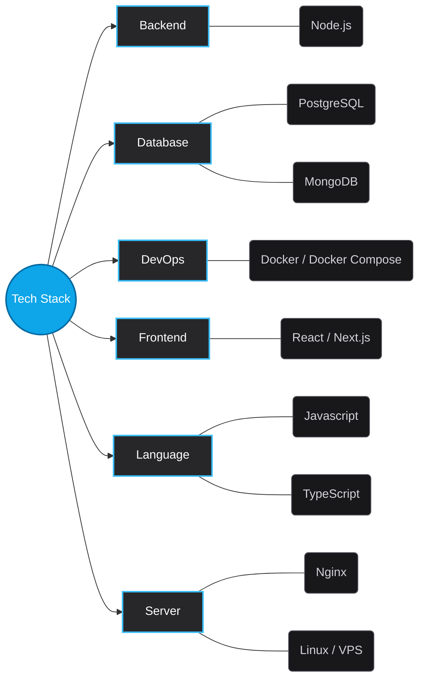

  

  
<b>Dedicated Fullstack Developer focusing on scalable architecture, performance optimization, and seamless user experiences.</b>

  

    
    
    
    
  

---

## 👨‍💻 About Me

As a Fullstack Developer with a strong foundation in JavaScript and practical experience across both frontend (React/Vue) and backend (Node.js/Express/NestJS) technologies, I am eager to contribute to the development of high-quality web products. My goal is to continuously advance my technical expertise while delivering long-term value to the company.

## 🛠️ Tech Stack & Skills

   
    
   
   
    
    

## 🏢 Experience & Education

### 💼 Web Developer @ Koolsoft Inc
> 📅 *Dec 2024 - Present* &nbsp; | &nbsp; 📍 *Ha Noi*

A software company operating in the EdTech sector. Developing web and mobile applications, providing e-learning solutions and online training systems for businesses and organizations.
(Related projects: Architecting core services for learning management systems, handling multi-format educational materials, and optimizing UI components and RESTful APIs).

### 💼 Web Developer @ DCASKS
> 📅 *Dec 2024 - Present* &nbsp; | &nbsp; 📍 *Remote*

Developing a blockchain ecosystem for the wine and spirits industry (RWA tokenization).
<ol><li data-list="bullet">DApp &amp; Smart Contracts: Developed a Telegram Mini App using Next.js 15, interacting with Smart Contracts (minting, real-time bidding) via Viem, and integrating Reown (WalletConnect). Built a comprehensive admin dashboard to monitor live auctions.</li><li data-list="bullet">Backend &amp; Real-time: Built a modular NestJS backend, Telegram bot logic, and utilized Socket.io and Redis Pub/Sub to deliver instant, real-time notifications for auction statuses.</li></ol>

### 💼 Nodejs Developer @ VITECH GROUP
> 📅 *Jun 2024 - Dec 2024* &nbsp; | &nbsp; 📍 *Hanoi*

Developed custom Windows applications designed to serve enterprise clients, community users, and internal business operations.
• Highlighted Project (MKT TIKPRO): Built a cross-platform desktop application using Electron.js to concurrently manage thousands of social media accounts. Integrated Puppeteer/Playwright for browser automation, extracting potential leads, automating engagement workflows, and minimizing ban rates.

### 💼 Frontend Developer @ ROCKET GAME STUDIO
> 📅 *Jun 2023 - Jun 2024* &nbsp; | &nbsp; 📍 *Hanoi*

A leading mobile game development and publishing company in Vietnam. Participated in developing user interfaces and features targeting the global market for Casual, Hyper-casual, and Mid-core game genres. Optimized performance and user experience for products with tens of millions of downloads worldwide.

### 💼 Web Developer Intern @ NTQ Solution JSC
> 📅 *Jan 2023 - Jun 2023* &nbsp; | &nbsp; 📍 *Hanoi*

Web Developer Intern at a premier IT Outsourcing company. Assisted in developing modules for software outsourcing projects and delivering digital transformation services for clients in Japan, Korea, Europe, and the US. Ensured code maintainability and acquired standard international software development processes.

### 🎓 Information Technology Engineer @ Hanoi University of Civil Engineering
> 📅 *Aug 2019 - Apr 2024* &nbsp; | &nbsp; 📍 *Hanoi*

Graduated with a major in Information Technology. Acquired a strong foundation in computer science, data structures, algorithms, and practical software development methodologies.

## 🚀 Featured Projects

<table>
  <tr>
    <td width="50%" valign="top">
      <h4>Dự án mẫu</h4>
      
Một dự án ví dụ để bạn thấy giao diện hiển thị.

      <code>Next.js</code> <code>TypeScript</code>  
    </td>
    <td width="50%" valign="top"></td>
  </tr>
</table>

  
  
<i>Auto-generated from Portfolio CMS Database 🚀</i>

