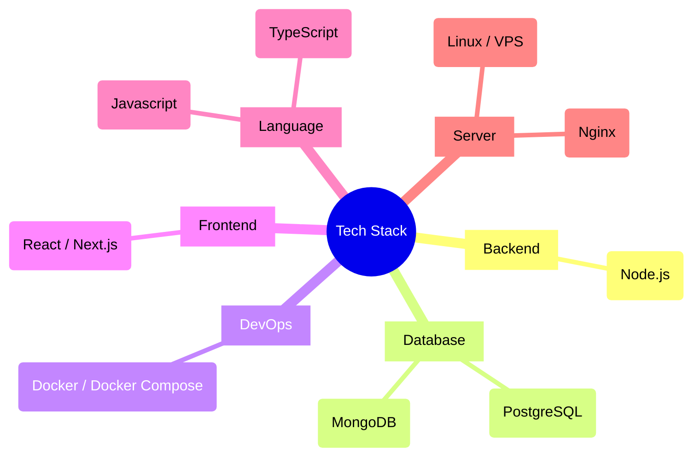
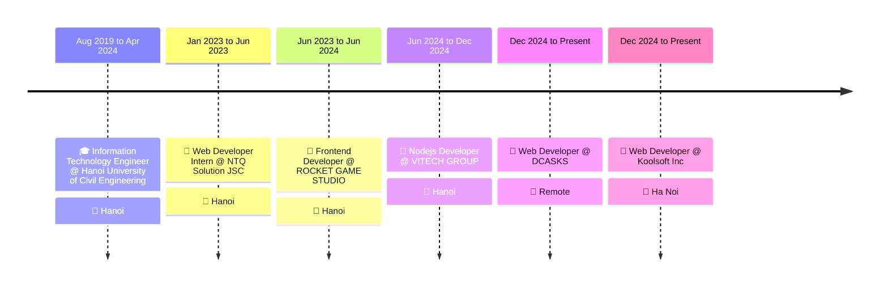

  

  
<b>Dedicated Fullstack Developer focusing on scalable architecture, performance optimization, and seamless user experiences.</b>

  

    
    
    
    
  

---

## 👨‍💻 About Me

As a Fullstack Developer with a strong foundation in JavaScript and practical experience across both frontend (React/Vue) and backend (Node.js/Express/NestJS) technologies, I am eager to contribute to the development of high-quality web products. My goal is to continuously advance my technical expertise while delivering long-term value to the company.

## 🛠️ Tech Stack & Skills

   
    
   
   
    
    

## 🏢 Experience & Education

## 🚀 Featured Projects

<table>
  <tr>
    <td width="50%" valign="top">
      <h4>Dự án mẫu</h4>
      
Một dự án ví dụ để bạn thấy giao diện hiển thị.

      <code>Next.js</code> <code>TypeScript</code>  
    </td>
    <td width="50%" valign="top"></td>
  </tr>
</table>

  
  
<i>Auto-generated from Portfolio CMS Database 🚀</i>

